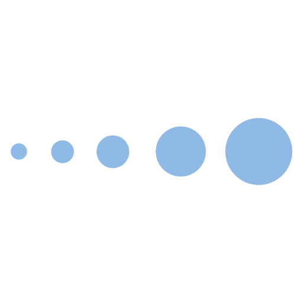

# Time-explicit Transition Pathway Optimization with `optimex`

This is a Python package for transition pathway optimization based on time-explicit Life Cycle Assessment (LCA). `optimex` helps identify optimal process portfolios and deployment timing in systems with multiple processes producing the same product, aiming to minimize dynamically accumulating environmental impacts over time. 

`optimex` builds on top of the optimization framework [pyomo](https://github.com/Pyomo/pyomo) and the LCA framework [Brightway](https://docs.brightway.dev/en/latest). If you are looking for a time-explicit LCA rather than an optimization tool, make sure to check out [`bw_timex`](https://docs.brightway.dev/projects/bw-timex/en/latest/).

## ✨ Features

Like other transition pathway optimization tools, `optimex` identifies the optimal timing and scale of process deployments to minimize environmental impacts over a transition period. What sets `optimex` apart is its integration of three additional, temporal considerations for environmental impacts:

::::{grid} 1 1 3 3
:gutter: 4

:::{grid-item-card}
:text-align: left

<div style="text-align: center;">
    
    
</div>

<div style="text-align: center; font-weight: bold; margin-bottom: 0.5rem">Life Cycle Timing</div>

The processes within a product's life cycle occur in sequence rather than all at once: production comes first, the use phase and end-of-life follow. As a result, emissions are also spread over time.
+++
`optimex` captures this by distributing process inputs and outputs over time.
:::

:::{grid-item-card}
:text-align: left

<div style="text-align: center;">
    
    
</div>

<div style="text-align: center; font-weight: bold; margin-bottom: 0.5rem">Technology Evolution</div>

In the future, processes will (hopefully) reduce their emissions. So, the time at which a process happens affects its impacts, with later occurence often resulting in lower emissions.
+++
`optimex` reflects this by allowing process inventories to change over time.
:::

:::{grid-item-card}
:text-align: left

<div style="text-align: center;">
    
    
</div>

<div style="text-align: center; font-weight: bold; margin-bottom: 0.5rem">Emission Accumulation</div>

Most impacts come from emission accumulation, but are typically modeled as separate pulses. Emission timing affects how they accumulate, influencing environmental impacts.
+++
`optimex` considers the emission timing, enabling characterization via dynamic LCIA.
:::

::::

During the transition pathway optimization, `optimex` simultaneously accounts for these temporal considerations, identifying the environmentally optimal process deployment over the transition period.

## 💬 Support

If you have any questions or need help, do not hesitate to contact us:
- Timo Diepers ([timo.diepers@ltt.rwth-aachen.de](mailto:timo.diepers@ltt.rwth-aachen.de))
- Jan Tautorus ([jan.tautorus@rwth-aachen.de](mailto:jan.tautorus@rwth-aachen.de))

```{toctree}
---
hidden:
maxdepth: 1
---
Installation <content/installation>
Theory <content/theory>
Examples <content/examples/index>
API <content/api/index>
Code of Conduct <content/codeofconduct>
Contributing <content/contributing>
License <content/license>
Changelog <content/changelog>
```
